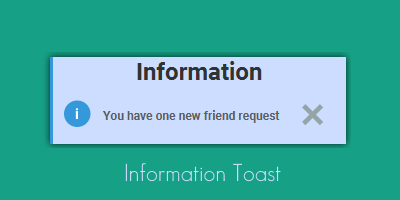
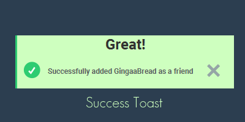
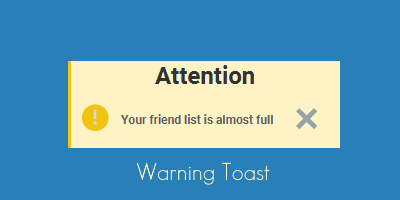
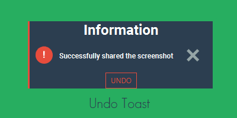

# JToasti
JToasti is a super simple Java library that allows the quick and beautiful implementation of toasts in JavaFX 

### The Toast Types






**Example**:


Naturally, the titles, descriptions, and icons can be customised.

<hr>

## Download & Installation:
Just add the jar to your project build path to use JToasti

Version 1.0:
www.shorturl.at/hFJ17

Version 2.0:
www.shorturl.at/bezHZ

<hr>

## How to use:
Create an object of the JToasti class and add it to a container. To spawn a toast simply use the spawnToast() method. ToastType describes the type of toast that will be displayed: Available types are information, warning, and success. These only differ in appearance. There is also the undo toast type that contains an undo button. You can add an event listener by using the setOnUndo() method. Finally, provide a title and description for your toast and that's all!

Simple Example:
```java
// Creates the toast container
JToasti toastContainer = new JToasti();
		
// You can use a simple lamda expression to add an undo event
toastContainer.setOnUndo( () -> System.out.println("Undid the last action"));
		
// Spawns an undo toast
anyButton.setOnAction(e -> toastContainer.spawnToast(ToastType.UNDO, "Deletion", "Successfully deleted the file"));
		
// Adds the toast container to the anchor pane
anchorPane.getChildren().add(toastContainer);
```

## Adjustments:
Of course you can change the toast icons as well as title and description fonts. You can also adjust the toast lifetime and its preferred height. In order to do so simply use the respective setter methods. As the JToasti class extends JavaFX's VBox, you can obviously use all VBox methods (like spacing) as well.  

<hr>

## License:
Please see the LICENSE file
